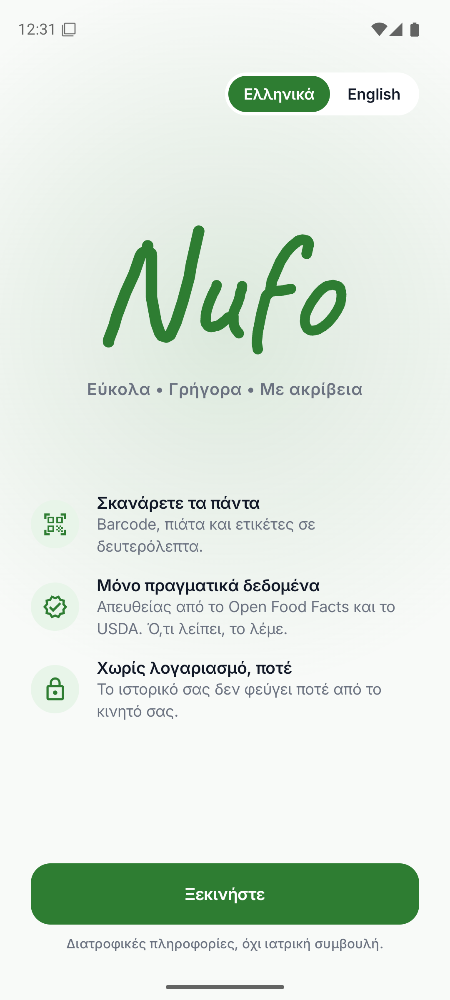
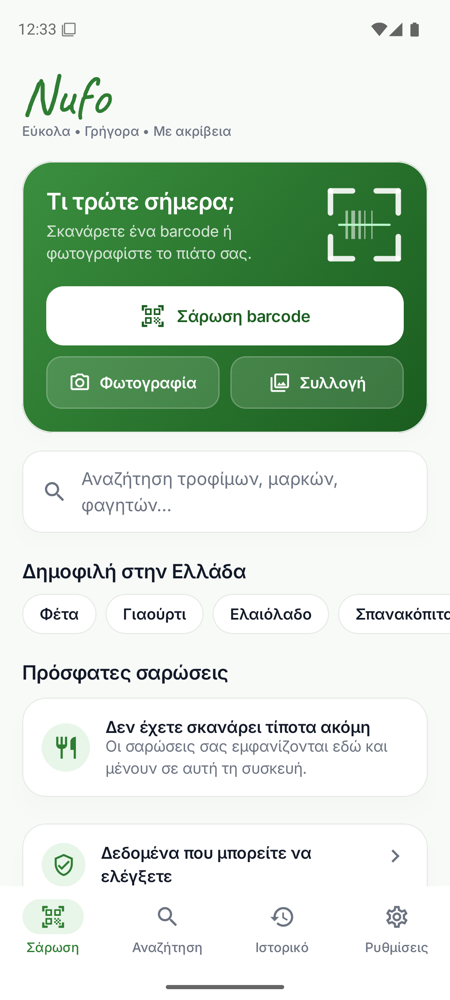
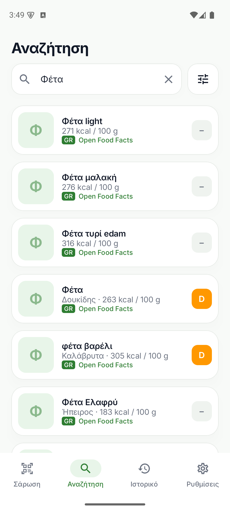
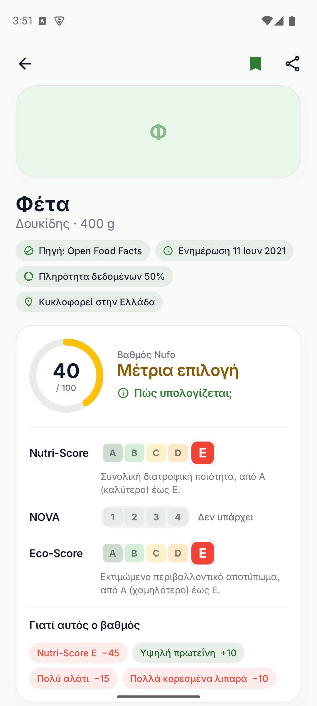
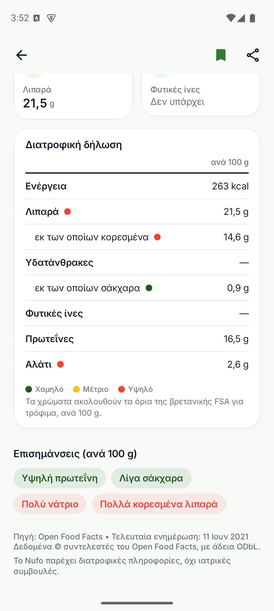
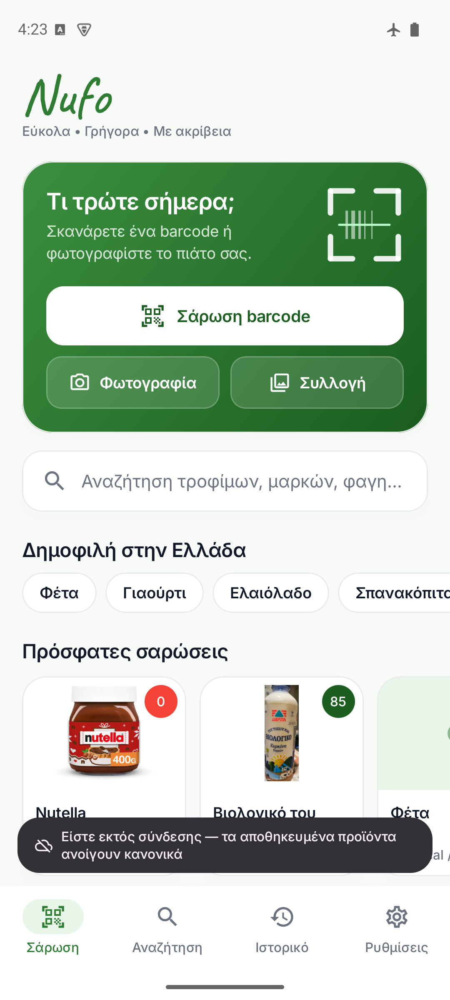
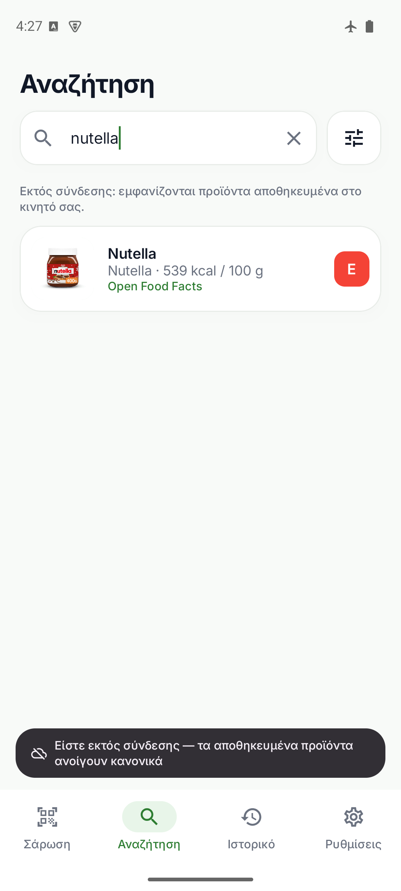
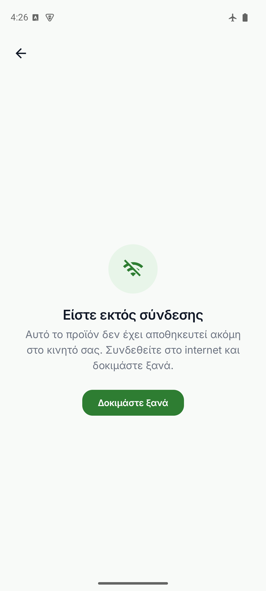
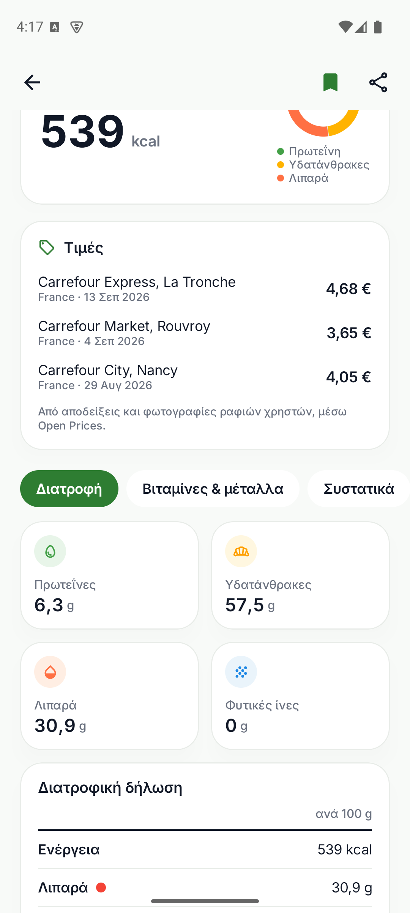
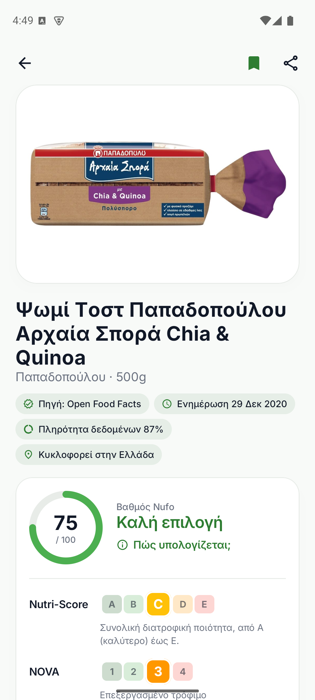

# Nufo

**Easy • Quick • Accurate** — a no-account nutrition scanner for Android (Kotlin + Jetpack Compose) and iOS (SwiftUI).

Scan a barcode, photograph a meal or its packaging, or search by name. Nufo shows real nutrition facts,
Nutri-Score, NOVA, Eco-Score and a transparent Nufo Score, with the source and last-updated date on every
result. Missing data is shown as "Not available", never made up. History and preferences stay on the device.

| Καλωσόρισμα | Αρχική | Αναζήτηση «Φέτα» | Αποτέλεσμα | Διατροφική δήλωση |
|---|---|---|---|---|
|  |  |  |  |  |

*(Android emulator, Greek UI, live data. English screenshots: `docs/screenshots/0*.png`.)*

| Offline home | Offline search | Offline, not saved | Prices | Long Greek name |
|---|---|---|---|---|
|  |  |  |  |  |

Frame-by-frame recordings: [opening animation](docs/screenshots/splash-sequence.png), [welcome](docs/screenshots/welcome-sequence.png),
[search → product transition](docs/screenshots/transition-sequence.png), [dark mode](docs/screenshots/el-dark.png).

## Built for Greece

- **Greek and English UI**, switchable on the first screen and in Settings (Android 13+ per-app language;
  iOS via the system Settings app). Polite plural throughout, Greek number and date formats ("16,5 g").
- **Greek products first.** Every search also runs against products Open Food Facts lists as sold in Greece
  (~6,200 today) and shows them first with a GR mark. A filter limits results to Greek products only.
- **Greek search that actually matches.** Queries run as typed, without accents ("γιαουρτι"), and in English
  via a 180-word Greek food dictionary ("φέτα" also finds "Feta cheese (P.D.O.)"). Whole-word matches rank
  above stemmed ones, so "φέτα" doesn't lead with sliced cheese. OCR typos fall back to fuzzy brand matching.
- **Greek names on products.** Product names and ingredients come in Greek when Open Food Facts has them;
  allergens, labels, categories and additives are translated through the Open Food Facts taxonomy, with a
  built-in fallback for the 14 EU allergens and common labels (ΠΟΠ, ΠΓΕ, Βιολογικό…).
- **Popular in Greece** quick searches on Home (φέτα, γιαούρτι, ελαιόλαδο, σπανακόπιτα…).
- Missing Greek product? The not-found screen links straight to adding it on Open Food Facts.

## Designed to be trusted

- **Provenance on every result:** source, last update, Open Food Facts' own data-completeness percentage,
  and "Sold in Greece".
- **Official-style grade scales** for Nutri-Score (A–E), NOVA (1–4) and Eco-Score, with the product's grade
  enlarged, plus a plain-language verdict ("Μέτρια επιλογή") and a "How is this calculated?" sheet listing
  every scoring rule.
- **EU nutrition declaration** laid out like the table on the pack (per 100 g and per portion), with UK FSA
  traffic-light dots for fat, saturates, sugars and salt.
- **Sanity checks:** energy above 900 kcal per 100 g is physically impossible, so it's treated as a kJ value
  typed in the wrong field (or hidden) instead of being shown.
- Inter typeface (Latin + Greek), hairline-edged cards, text colours checked for contrast.
## Repository layout

```
android/            Kotlin · Jetpack Compose · Material 3 · Room · DataStore · CameraX · ML Kit · OkHttp · Coil
ios/                SwiftUI · SwiftData · VisionKit · Vision · PhotosPicker · Swift Charts (XcodeGen project spec)
docs/API.md         Shared API contract: endpoints, field mapping, scoring. Both apps implement it identically.
branding/           App icon (SVG + 1024 px PNG) and the Tegaki "Nufo" handwriting SVG
.env.example        Optional API keys (none are required)
```

## Data sources

| Source | Used for | Key |
|---|---|---|
| Open Food Facts (product API + Search-a-licious) | Barcodes, packaged products, Nutri-Score, NOVA, Eco-Score, ingredients, allergens | none |
| USDA FoodData Central | Generic and branded foods, barcode fallback | free; falls back to `DEMO_KEY` |
| Open Prices (by Open Food Facts) | Latest shopper-reported shelf prices, Greek stores first | none |
| UPCitemdb (free trial endpoint) | Last-resort identity (name, photo) for barcodes no food database has | none, ~100 lookups/day per IP |

The prompt also listed Edamam, Nutritionix, CalorieNinjas, API-Ninjas, Spoonacular and TheMealDB. Each needs
a secret key, which would have to sit behind a proxy for a no-account app. They are not wired in: Open Food
Facts plus USDA already cover barcodes, packaged foods and generic foods with no keys at all.

## Offline, states and performance

- **Offline:** every product looked up is cached on the device (Room table on Android, files in Application
  Support on iOS) and product photos stay in the image cache. Without a connection, saved products open with
  an "offline copy from <date>" note, search falls back to saved products, and a banner says so. Coming back
  online refreshes offline results automatically.
- **Four states on every screen:** loading (skeletons shaped like the content, plus the tapped product's photo
  and name immediately), success, empty (with a next step), and error — which says whether *you* are offline
  or the *database* is down, with Retry. Unknown barcodes show what UPCitemdb knows about them, if anything.
- **Waiting is designed too** (`Wait.kt`, `Wait` in `Components.swift`): nothing for the first 0.4 s so fast
  answers never flash a loader; skeletons for whole screens, a thin bar only when refreshing results already
  shown, never both; after 1 s a line naming the real step ("Checking Open Food Facts…", "Not there, checking
  USDA…"); after 7 s it admits it is slow; at 15 s the lookup stops and offers the saved copy or Retry.
- **Measured on the Pixel API 35 emulator, release build (`benchmark` build type, R8 + resource shrinking):**
  cold start median 843 ms (774–1277 ms over 5 runs), search-list scrolling 1.3 % janky frames (p90 20 ms),
  74 MB memory. The APK went from 112 MB to 25 MB (about 8 MB per device from Play Store) by bundling only the
  barcode model and taking OCR and image-labeling models from Google Play services.
- **Photos:** thumbnails use Open Food Facts' 400 px rendition (sharp on 3× screens); the product page layers
  the full-resolution photo on top once it arrives, decoded at display size.

## Android

Requirements: JDK 17+, Android SDK 36, an emulator or device.

```bash
cd android
./gradlew testDebugUnitTest            # 29 unit tests: scoring, parsers, prices, Greek search, image sizes
./gradlew assembleDebug
emulator -list-avds
emulator -avd <your_avd> -dns-server 8.8.8.8
adb -s emulator-5554 install -r app/build/outputs/apk/debug/app-debug.apk
adb -s emulator-5554 shell am start -n com.nufo.app/.MainActivity
ANDROID_SERIAL=emulator-5554 ./gradlew connectedDebugAndroidTest   # UI tests: scan → result → history
ANDROID_SERIAL=emulator-5554 ./gradlew installBenchmark            # release code, debug-signed, for measuring
```

- Emulator cameras can't read real packaging. On the scanner, tap **Type code**; debug builds also offer
  sample barcodes (Nutella, Coca-Cola, …). The emulator's virtual-scene camera works for the live preview.
- For the photo flow, push any food photo: `adb -s emulator-5554 push food.jpg /sdcard/Pictures/`.
- To test offline behaviour: `adb -s emulator-5554 shell cmd connectivity airplane-mode enable` (and `disable`).
- If lookups fail with "The food database isn't responding" on an emulator, its DNS is usually broken.
  Start it with `-dns-server 8.8.8.8`.
- Architecture: one `NufoViewModel` plus a hand-rolled container in `NufoApp` instead of Hilt, and
  OkHttp + kotlinx.serialization instead of Retrofit. The app is small enough that the frameworks would
  add build time without adding value.

### Release (Android)

- Version 1.0.0 (versionCode 1). Download page: https://nufo.vercel.app. Builds are attached to the
  GitHub release `v1.0.0`.
- Signing key: `~/.android/nufo-release.jks`, described by `~/.android/nufo-release.properties`
  (storeFile, storePassword, keyAlias, keyPassword), both outside the repo. Another location: set
  `NUFO_SIGNING` to the properties file. **Back both up**: without the key, no updates can be published.
- `./gradlew assembleRelease` gives one APK per CPU type (`arm64-v8a` for nearly all phones,
  `armeabi-v7a` for old 32-bit ones, `x86_64` for emulators). `./gradlew bundleRelease` gives the `.aab`
  for Google Play (built separately: AGP cannot split APKs while bundling).
- CI (`.github/workflows/android.yml`) runs unit tests, lint and an unsigned release build on every push
  to `android/`.

## iOS

Requirements: macOS with Xcode 15+ and [XcodeGen](https://github.com/yonaskolb/XcodeGen).

```bash
cd ios
brew install xcodegen && xcodegen      # generates Nufo.xcodeproj from project.yml
xcodebuild -scheme Nufo -destination 'platform=iOS Simulator,name=iPhone 15 Pro' test
xcrun simctl boot "iPhone 15 Pro"; open -a Simulator
xcodebuild -scheme Nufo -destination 'platform=iOS Simulator,name=iPhone 15 Pro' -derivedDataPath build build
xcrun simctl install booted build/Build/Products/Debug-iphonesimulator/Nufo.app
xcrun simctl launch booted com.nufo.app
```

- In the Simulator, VisionKit live scanning isn't available, so the scanner switches to a mock scanner
  (type a barcode or tap a sample).
- **Not yet compiled.** The iOS project was written on Windows, where no Xcode is available.
  `.github/workflows/ios.yml` builds and tests it on a GitHub macOS runner (on changes to `ios/`, or run it
  by hand from the Actions tab); expect a round of compiler fixes on its first run.
- Not yet ported from Android: on-device dish recognition (FoodClassifier) and the bundled dish table.

## Motion and branding

- **One motion system** (`Motion.kt`, `Motion` in `Theme.swift`): three durations (150 / 250 / 400 ms), one
  strong ease-out and one ease-in-out curve, one spring for movement, 45 ms stagger. Forward navigation slides
  in from the right and back is its exact mirror; peers (tabs, welcome to home) fade through; content swapping
  in place crossfades. Entrances play the first time a screen appears, not on every return.
- **Opening animation** — starts from the exact launcher icon (no second pop), then one 700 ms beat: the
  scanner corners focus, a scan line sweeps, the leaf pulses. The icon then leaves small and fast, and the
  first screen rises in *after* the hand-off instead of invisibly underneath it.
- **Opening and closing products** — the tapped product's photo flies into the product page and back
  (Compose shared elements; iOS 18 zoom navigation transition). Android supports predictive back.
- **Welcome animation** — Nufo's handwritten logo comes from [Tegaki](https://github.com/gkurt/tegaki)
  (`npx tegaki "Nufo" --font caveat --mode once`). Tegaki is a web library, so the exported pen strokes,
  timings and easing curve are replayed natively (`TegakiLogo.kt`, `TegakiLogo.swift`).
  The welcome screen runs on one clock: the glow blooms, the signature writes, and the three features rise in
  while it writes (each icon acts out its point once: a scan sweep, a confirming pulse, a lock swinging shut).
  The button is ready at about 1.1 s. Switching language does not replay the intro.
- **Text and number transitions** — [Calligraph](https://calligraph.raphaelsalaja.com/) is a React/Motion
  library, so its effects are ported natively: per-character staggered entrances and rolling digit slots
  (`Calligraph.kt`, `Calligraph.swift`, which uses SwiftUI's `numericText`).
- One spring drives screen transitions, cards, chips, tabs and the score ring. Pressed cards sink slightly
  and list items stagger in. Decorative motion is off when the system's reduce-motion setting is on.
- Icon: scanner corners around a leaf on Nufo green (`branding/nufo-icon.svg`); Android uses an adaptive vector icon.

## Privacy

No sign-up, no login, no analytics. Only a barcode or search text is sent to the food databases. Photos
are analyzed on-device (ML Kit / Vision). History is excluded from Android cloud backup.
*Nufo provides nutrition information, not medical advice.*