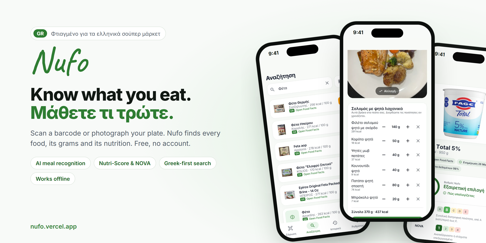
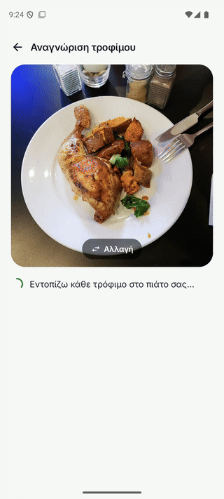
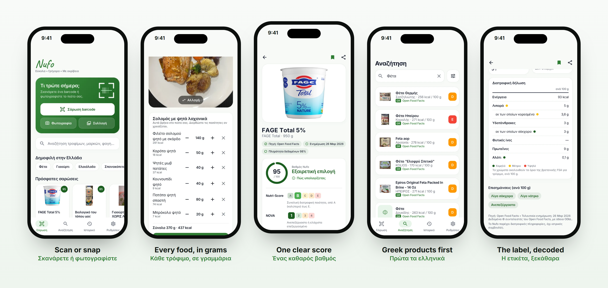

<p align="center">
  
</p>

<p align="center">
  <a href="https://nufo.vercel.app"></a>
  <a href="https://github.com/TPAINN/nufo/releases/latest"></a>
</p>

<p align="center">
  <a href="https://github.com/TPAINN/nufo/actions/workflows/android.yml"></a>
  <a href="https://github.com/TPAINN/nufo/actions/workflows/ios.yml"></a>
  
  
  
  
</p>

<h3 align="center">Scan a barcode or photograph your plate.<br>Nufo tells you what is in it: in Greek, in seconds, for free.</h3>
<p align="center"><i>Σκανάρετε το barcode ή φωτογραφίστε το πιάτο σας. Το Nufo σας λέει τι περιέχει, στα ελληνικά, σε δευτερόλεπτα, δωρεάν.</i></p>

<br>

## Photograph your plate. See every food on it.

<table>
<tr>
<td width="340" valign="top"></td>
<td valign="top">

**Chicken with sweet potato is not muesli.** Point Nufo at a plate and it lists each food separately, with how it is cooked and how many grams are there:

- **Roast chicken leg** · 200 g · 430 kcal
- **Roasted sweet potato** · 150 g · 135 kcal
- **Sautéed kale** · 50 g · 14 kcal

Wrong amount? One tap on **+** or **−** and every number follows. Then open the full picture: calories, macros, the EU nutrition declaration, traffic-light dots and the Nufo Score for the whole meal.

Nutrition per 100 g comes from **USDA FoodData Central** whenever it agrees with the model's reading, and is labelled as an estimate when it does not. Tested on **107 real meal photos**: grilled chicken, salmon and vegetables, oatmeal versus muesli, poke bowls, horiatiki, gemista, gyros.

</td>
</tr>
</table>

## Why people keep it on their phone

| | |
|---|---|
| **One honest score** | A 0 to 100 Nufo Score with every rule visible: Nutri-Score, NOVA processing, sugar, salt, saturated fat, protein, fibre. Tap "How is this calculated?" and see exactly why. |
| **The official scales** | Nutri-Score A to E, NOVA 1 to 4 and Eco-Score, drawn like the badges on the pack, with the product's grade enlarged. |
| **Built for Greece** | Greek UI, Greek search with or without accents ("γιαουρτι" works), and the ~6,200 products sold in Greece shown first with a GR mark. |
| **Real data only** | Every result shows its source, last update and completeness. Missing means missing: Nufo never invents a number. |
| **Prices from real receipts** | Recent shelf prices from Open Prices, Greek stores first. |
| **Works in the basement** | Everything you have scanned opens offline, with its photo. Search falls back to your saved products. |
| **No account, ever** | No sign-up, no email, no ads, no tracking. Your history stays on your phone. |

<p align="center">
  
</p>

## How it works

1. **Open it and scan.** No sign-up. The camera reads the barcode on the phone itself.
2. **Or photograph your plate.** Nufo finds each food and its grams; you correct anything in one tap.
3. **Read one screen.** Score, grades, allergens that matter to you, and the full label, in Greek.

## Get Nufo

- **Android 8+**: download from **[nufo.vercel.app](https://nufo.vercel.app)** or the [latest release](https://github.com/TPAINN/nufo/releases/latest) (`nufo-1.0.2.apk`; `-32bit` for older phones). It updates in place and keeps your history, and it tells you once a day when a new version is out.
- **iPhone**: the SwiftUI app builds and passes its tests in CI; TestFlight follows once the Apple Developer account is set up.

## Data sources

[Open Food Facts](https://world.openfoodfacts.org) (ODbL) for packaged products · [USDA FoodData Central](https://fdc.nal.usda.gov) (public domain) for generic foods, dishes and meal nutrition · [Open Prices](https://prices.openfoodfacts.org) for shelf prices · Google Gemini, through the Nufo analysis service, to recognise meal photos.

Nufo provides nutrition information, not medical advice.

---

## For developers

The full technical write-up: how Greek search works, the scoring rules, offline behaviour, motion, and how to build, test and release both apps. Click a section to open it.

<details>
<summary><b>Built for Greece</b></summary>

- **Greek and English UI**, switchable on the first screen and in Settings (Android 13+ per-app language;
  iOS via the system Settings app). Polite plural throughout, Greek number and date formats ("16,5 g").
- **Greek products first.** Every search also runs against products Open Food Facts lists as sold in Greece
  (~6,200 today) and shows them first with a GR mark. A filter limits results to Greek products only.
- **Greek search that actually matches.** Queries run as typed, without accents ("γιαουρτι"), and in English
  via a 180-word Greek food dictionary ("φέτα" also finds "Feta cheese (P.D.O.)"). Whole-word matches rank
  above stemmed ones, so "φέτα" doesn't lead with sliced cheese. OCR typos fall back to fuzzy brand matching.
- **Greek names on products.** Product names and ingredients come in Greek when Open Food Facts has them;
  allergens, labels, categories and additives are translated through the Open Food Facts taxonomy, with a
  built-in fallback for the 14 EU allergens and common labels (ΠΟΠ, ΠΓΕ, Βιολογικό…).
- **Popular in Greece** quick searches on Home (φέτα, γιαούρτι, ελαιόλαδο, σπανακόπιτα…).
- Missing Greek product? The not-found screen links straight to adding it on Open Food Facts.

</details>

<details>
<summary><b>Designed to be trusted</b></summary>

- **Provenance on every result:** source, last update, Open Food Facts' own data-completeness percentage,
  and "Sold in Greece".
- **Official-style grade scales** for Nutri-Score (A–E), NOVA (1–4) and Eco-Score, with the product's grade
  enlarged, plus a plain-language verdict ("Μέτρια επιλογή") and a "How is this calculated?" sheet listing
  every scoring rule.
- **EU nutrition declaration** laid out like the table on the pack (per 100 g and per portion), with UK FSA
  traffic-light dots for fat, saturates, sugars and salt.
- **Sanity checks:** energy above 900 kcal per 100 g is physically impossible, so it's treated as a kJ value
  typed in the wrong field (or hidden) instead of being shown.
- Inter typeface (Latin + Greek), hairline-edged cards, text colours checked for contrast.

</details>

<details>
<summary><b>Repository layout</b></summary>

```
android/            Kotlin · Jetpack Compose · Material 3 · Room · DataStore · CameraX · ML Kit · OkHttp · Coil
ios/                SwiftUI · SwiftData · VisionKit · Vision · PhotosPicker · Swift Charts (XcodeGen project spec)
docs/API.md         Shared API contract: endpoints, field mapping, scoring. Both apps implement it identically.
branding/           App icon (SVG + 1024 px PNG) and the Tegaki "Nufo" handwriting SVG
.env.example        Optional API keys (none are required)
```

</details>

<details>
<summary><b>Data sources</b></summary>

| Source | Used for | Key |
|---|---|---|
| Open Food Facts (product API + Search-a-licious) | Barcodes, packaged products, Nutri-Score, NOVA, Eco-Score, ingredients, allergens | none |
| USDA FoodData Central | Generic and branded foods, barcode fallback | free; falls back to `DEMO_KEY` |
| Open Prices (by Open Food Facts) | Latest shopper-reported shelf prices, Greek stores first | none |
| Nufo meal analysis (`nufo.vercel.app/api/analyze`, Gemini) | Every food in a meal photo, its grams, nutrition cross-checked with USDA FNDDS | server-side only |
| UPCitemdb (free trial endpoint) | Last-resort identity (name, photo) for barcodes no food database has | none, ~100 lookups/day per IP |

The prompt also listed Edamam, Nutritionix, CalorieNinjas, API-Ninjas, Spoonacular and TheMealDB. Each needs
a secret key, which would have to sit behind a proxy for a no-account app. They are not wired in: Open Food
Facts plus USDA already cover barcodes, packaged foods and generic foods with no keys at all.

</details>

<details>
<summary><b>Offline, states and performance</b></summary>

- **Offline:** every product looked up is cached on the device (Room table on Android, files in Application
  Support on iOS) and product photos stay in the image cache. Without a connection, saved products open with
  an "offline copy from <date>" note, search falls back to saved products, and a banner says so. Coming back
  online refreshes offline results automatically.
- **Four states on every screen:** loading (skeletons shaped like the content, plus the tapped product's photo
  and name immediately), success, empty (with a next step), and error — which says whether *you* are offline
  or the *database* is down, with Retry. Unknown barcodes show what UPCitemdb knows about them, if anything.
- **Waiting is designed too** (`Wait.kt`, `Wait` in `Components.swift`): nothing for the first 0.4 s so fast
  answers never flash a loader; skeletons for whole screens, a thin bar only when refreshing results already
  shown, never both; after 1 s a line naming the real step ("Checking Open Food Facts…", "Not there, checking
  USDA…"); after 7 s it admits it is slow; at 15 s the lookup stops and offers the saved copy or Retry.
- **Measured on the Pixel API 35 emulator, release build (`benchmark` build type, R8 + resource shrinking):**
  cold start median 843 ms (774–1277 ms over 5 runs), search-list scrolling 1.3 % janky frames (p90 20 ms),
  74 MB memory. The APK went from 112 MB to 25 MB (about 8 MB per device from Play Store) by bundling only the
  barcode model and taking OCR and image-labeling models from Google Play services.
- **Photos:** thumbnails use Open Food Facts' 400 px rendition (sharp on 3× screens); the product page layers
  the full-resolution photo on top once it arrives, decoded at display size.

</details>

<details>
<summary><b>Android</b></summary>

Requirements: JDK 17+, Android SDK 36, an emulator or device.

```bash
cd android
./gradlew testDebugUnitTest            # 38 unit tests: scoring, parsers, meals, dishes, updates, Greek search
./gradlew assembleDebug
emulator -list-avds
emulator -avd <your_avd> -dns-server 8.8.8.8
adb -s emulator-5554 install -r app/build/outputs/apk/debug/app-debug.apk
adb -s emulator-5554 shell am start -n com.nufo.app/.MainActivity
ANDROID_SERIAL=emulator-5554 ./gradlew connectedDebugAndroidTest   # UI tests: scan → result → history
ANDROID_SERIAL=emulator-5554 ./gradlew installBenchmark            # release code, debug-signed, for measuring
```

- Emulator cameras can't read real packaging. On the scanner, tap **Type code**; debug builds also offer
  sample barcodes (Nutella, Coca-Cola, …). The emulator's virtual-scene camera works for the live preview.
- For the photo flow, push any food photo: `adb -s emulator-5554 push food.jpg /sdcard/Pictures/`.
- To test offline behaviour: `adb -s emulator-5554 shell cmd connectivity airplane-mode enable` (and `disable`).
- If lookups fail with "The food database isn't responding" on an emulator, its DNS is usually broken.
  Start it with `-dns-server 8.8.8.8`.
- Architecture: one `NufoViewModel` plus a hand-rolled container in `NufoApp` instead of Hilt, and
  OkHttp + kotlinx.serialization instead of Retrofit. The app is small enough that the frameworks would
  add build time without adding value.

### Release (Android)

- Version 1.0.2 (versionCode 3). Download page: https://nufo.vercel.app. Builds are attached to the
  GitHub release `v1.0.2`. The app checks the latest release once a day (toggle in Settings).
- Signing key: `~/.android/nufo-release.jks`, described by `~/.android/nufo-release.properties`
  (storeFile, storePassword, keyAlias, keyPassword), both outside the repo. Another location: set
  `NUFO_SIGNING` to the properties file. **Back both up**: without the key, no updates can be published.
- `./gradlew assembleRelease` gives one APK per CPU type (`arm64-v8a` for nearly all phones,
  `armeabi-v7a` for old 32-bit ones, `x86_64` for emulators). `./gradlew bundleRelease` gives the `.aab`
  for Google Play (built separately: AGP cannot split APKs while bundling).
- CI (`.github/workflows/android.yml`) runs unit tests, lint and an unsigned release build on every push
  to `android/`.

</details>

<details>
<summary><b>iOS</b></summary>

Requirements: macOS with Xcode 15+ and [XcodeGen](https://github.com/yonaskolb/XcodeGen).

```bash
cd ios
brew install xcodegen && xcodegen      # generates Nufo.xcodeproj from project.yml
xcodebuild -scheme Nufo -destination 'platform=iOS Simulator,name=iPhone 15 Pro' test
xcrun simctl boot "iPhone 15 Pro"; open -a Simulator
xcodebuild -scheme Nufo -destination 'platform=iOS Simulator,name=iPhone 15 Pro' -derivedDataPath build build
xcrun simctl install booted build/Build/Products/Debug-iphonesimulator/Nufo.app
xcrun simctl launch booted com.nufo.app
```

- In the Simulator, VisionKit live scanning isn't available, so the scanner switches to a mock scanner
  (type a barcode or tap a sample).
- **Built and tested in CI.** The iOS project is written on Windows (no Xcode); `.github/workflows/ios.yml`
  generates the project and runs the 20 unit tests on a GitHub macOS runner (on changes to `ios/`, or by
  hand from the Actions tab). Last run: build and tests green.
- **Distribution needs an Apple Developer account** (enrolment and signing are the owner's). With it, CI can
  sign and upload to TestFlight, and the landing page's App Store badge becomes a real link.
- Not yet ported from Android: AI meal recognition, on-device dish recognition (FoodClassifier) and the bundled dish table.

</details>

<details>
<summary><b>Motion and branding</b></summary>

- **One motion system** (`Motion.kt`, `Motion` in `Theme.swift`): three durations (150 / 250 / 400 ms), one
  strong ease-out and one ease-in-out curve, one spring for movement, 45 ms stagger. Forward navigation slides
  in from the right and back is its exact mirror; peers (tabs, welcome to home) fade through; content swapping
  in place crossfades. Entrances play the first time a screen appears, not on every return.
- **Opening animation** — starts from the exact launcher icon (no second pop), then one 700 ms beat: the
  scanner corners focus, a scan line sweeps, the leaf pulses. The icon then leaves small and fast, and the
  first screen rises in *after* the hand-off instead of invisibly underneath it.
- **Opening and closing products** — the tapped product's photo flies into the product page and back
  (Compose shared elements; iOS 18 zoom navigation transition). Android supports predictive back.
- **Welcome animation** — Nufo's handwritten logo comes from [Tegaki](https://github.com/gkurt/tegaki)
  (`npx tegaki "Nufo" --font caveat --mode once`). Tegaki is a web library, so the exported pen strokes,
  timings and easing curve are replayed natively (`TegakiLogo.kt`, `TegakiLogo.swift`).
  The welcome screen runs on one clock: the glow blooms, the signature writes, and the three features rise in
  while it writes (each icon acts out its point once: a scan sweep, a confirming pulse, a lock swinging shut).
  The button is ready at about 1.1 s. Switching language does not replay the intro.
- **Text and number transitions** — [Calligraph](https://calligraph.raphaelsalaja.com/) is a React/Motion
  library, so its effects are ported natively: per-character staggered entrances and rolling digit slots
  (`Calligraph.kt`, `Calligraph.swift`, which uses SwiftUI's `numericText`).
- One spring drives screen transitions, cards, chips, tabs and the score ring. Pressed cards sink slightly
  and list items stagger in. Decorative motion is off when the system's reduce-motion setting is on.
- Icon: scanner corners around a leaf on Nufo green (`branding/nufo-icon.svg`); Android uses an adaptive vector icon.

</details>

<details>
<summary><b>Privacy</b></summary>

No sign-up, no login, no analytics. Only a barcode or search text is sent to the food databases. Meal
photos go to the Nufo analysis service (below) unless Smart analysis is off in Settings; barcodes and labels
are read on-device (ML Kit / Vision). History is excluded from Android cloud backup.
*Nufo provides nutrition information, not medical advice.*

</details>
